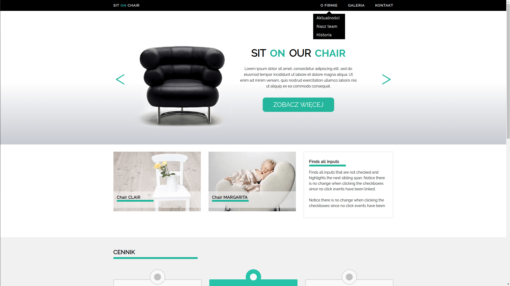
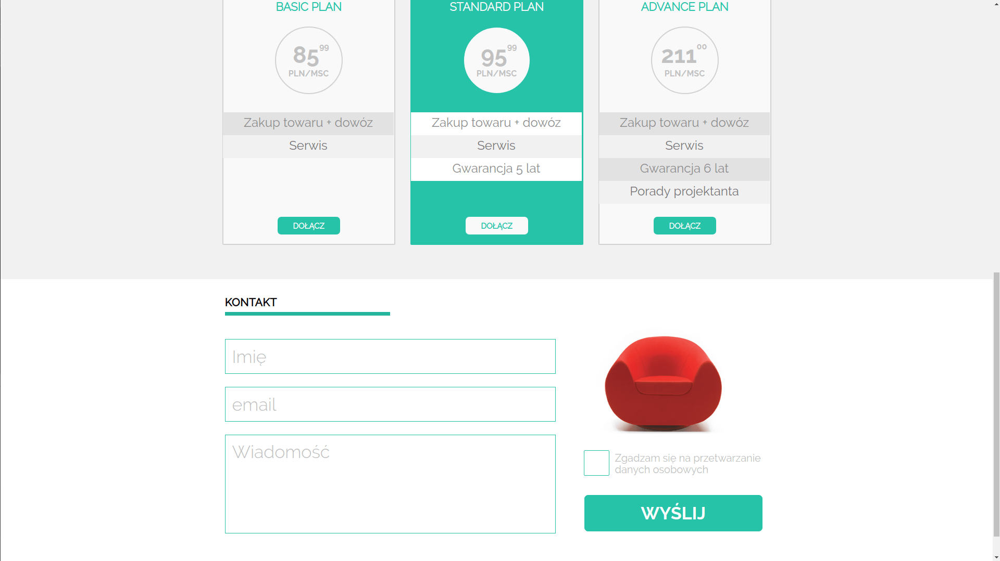

# Sit On Chair

1st Workshop conducte after 1st week of Coder's Lab "JavaScript Developer: React" course - HTML & CSS.

The aim of the workshop was to recreate a website basing on the design provided in jpg file.

Later on added functionalities in JavaScript:
* Dropdown menu display
* Slider

Technologies used:
* HTML
* CSS
* JavaScript

Preview:

https://nyziek.pl/sit_on_chair

Screenshots:

